# Final Live Verification Report

Generated at: 2026-09-24T08:13:04.731124

## Day 01 Visualizer
- **Status**: PASS
- **Play/Pause**: True/True
- **Next/Prev**: True/True
- **Reset**: True
- **Java Sync**: False
- **Mobile**: True

### States
1. **Initial**: Initialize: L=0 (val=2), R=3 (val=15)
2. **Middle**: sum = arr[L]+arr[R] = 2+15 = 17 > target(9) → R--
3. **Final**: sum = arr[L]+arr[R] = 2+15 = 17 > target(9) → R--

### Screenshots
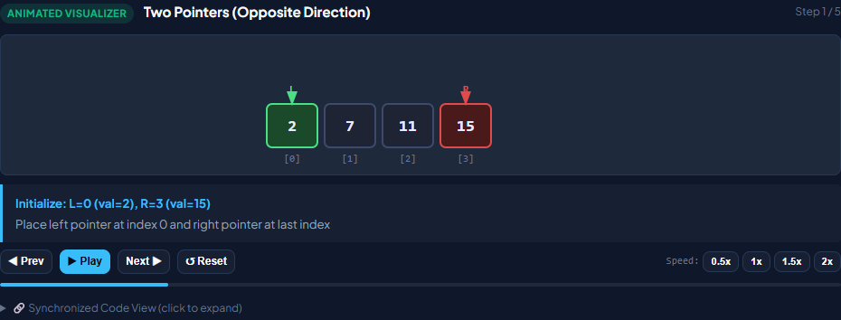
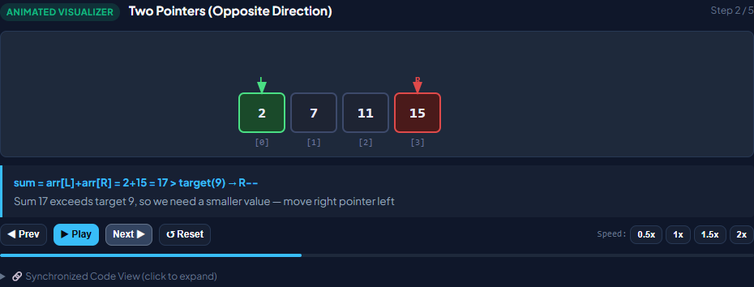
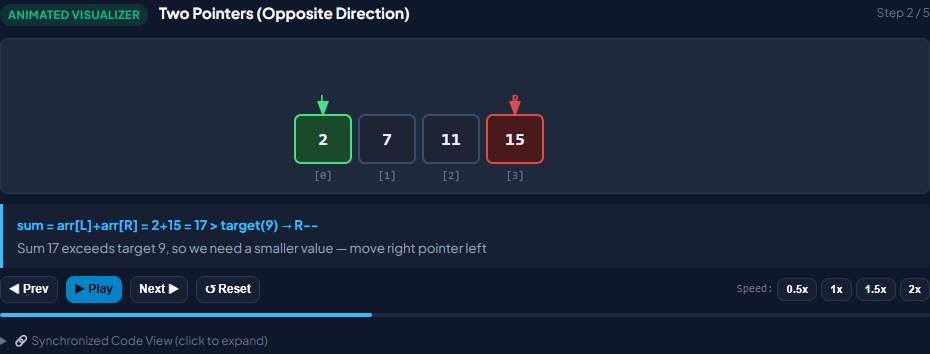

## Day 02 Visualizer
- **Status**: PASS
- **Play/Pause**: True/True
- **Next/Prev**: True/True
- **Reset**: True
- **Java Sync**: False
- **Mobile**: True

### States
1. **Initial**: Initialize window [0..2]: sum = 1+3+(-1) = 3
2. **Middle**: Slide window: remove arr[0]=1, add arr[3]=-3 → sum = 2+(-3) = -1
3. **Final**: Slide window: remove arr[0]=1, add arr[3]=-3 → sum = 2+(-3) = -1

### Screenshots
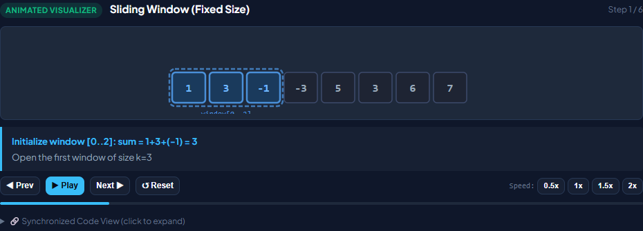

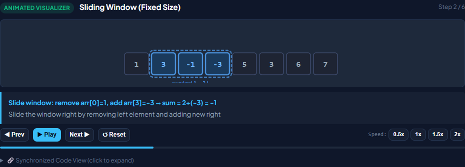

## Day 05 Visualizer
- **Status**: PASS
- **Play/Pause**: True/True
- **Next/Prev**: True/True
- **Reset**: True
- **Java Sync**: False
- **Mobile**: True

### States
1. **Initial**: Initialize empty stack
2. **Middle**: Push 3 → stack: [3]
3. **Final**: Push 3 → stack: [3]

### Screenshots
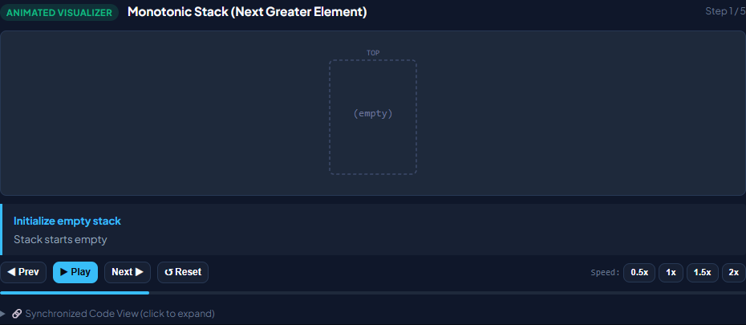
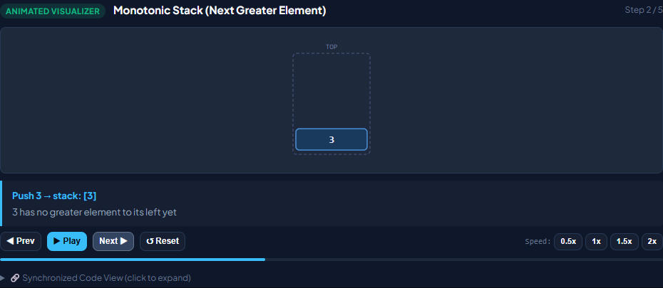
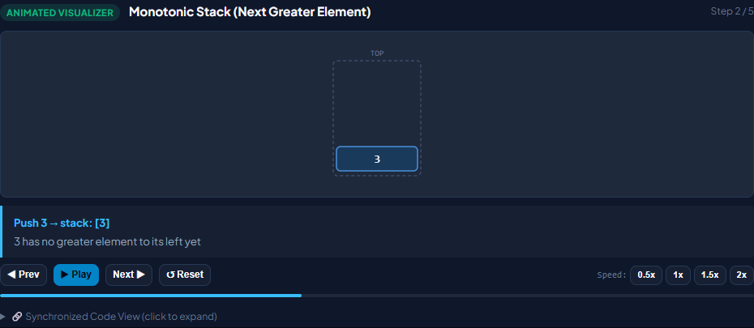

## Day 10 Visualizer
- **Status**: PASS
- **Play/Pause**: True/True
- **Next/Prev**: True/True
- **Reset**: True
- **Java Sync**: False
- **Mobile**: True

### States
1. **Initial**: Initialize window [0..2]: sum = 1+3+(-1) = 3
2. **Middle**: Slide window: remove arr[0]=1, add arr[3]=-3 → sum = 2+(-3) = -1
3. **Final**: Slide window: remove arr[0]=1, add arr[3]=-3 → sum = 2+(-3) = -1

### Screenshots
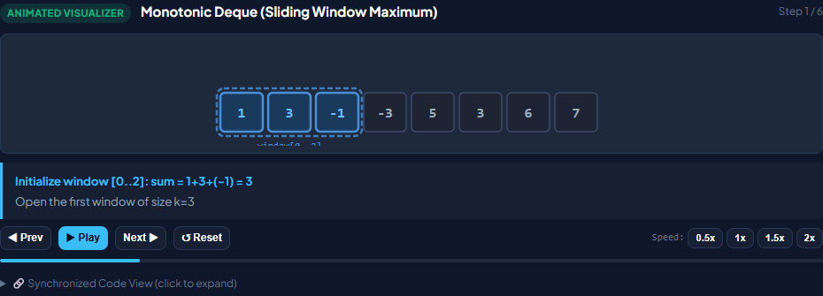
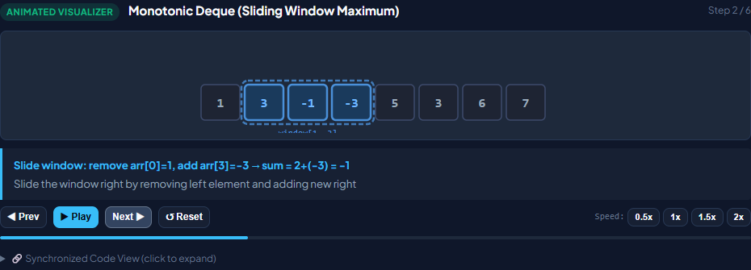
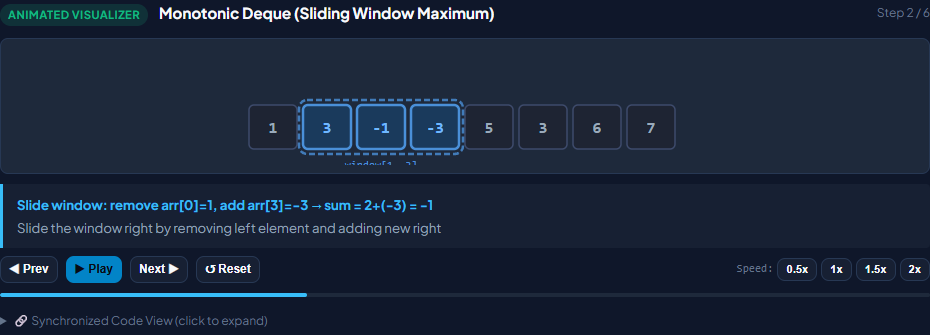

## Day 15 Visualizer
- **Status**: PASS
- **Play/Pause**: True/True
- **Next/Prev**: True/True
- **Reset**: True
- **Java Sync**: False
- **Mobile**: True

### States
1. **Initial**: Visit root: 1
2. **Middle**: Go left → Visit: 2
3. **Final**: Go left → Visit: 2

### Screenshots
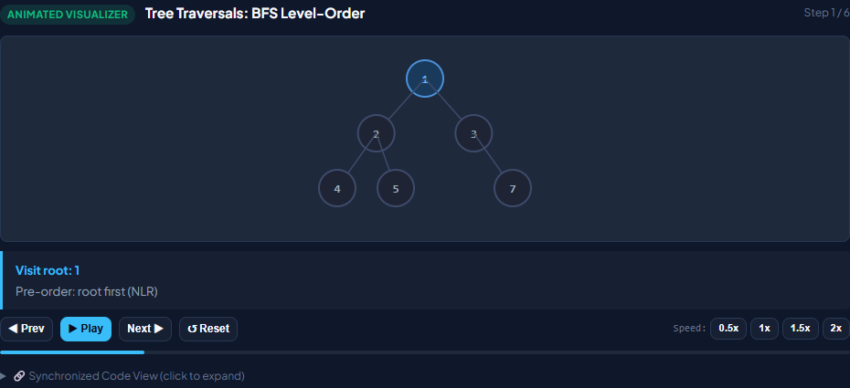
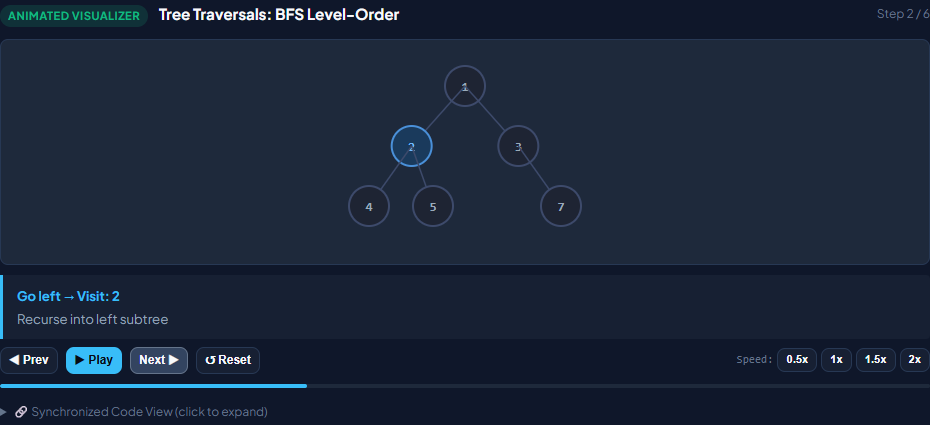
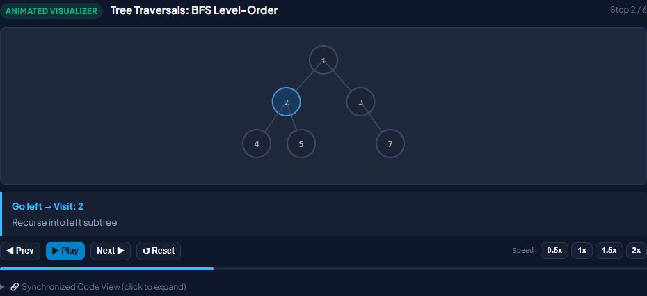

## Day 20 Visualizer
- **Status**: PASS
- **Play/Pause**: True/True
- **Next/Prev**: True/True
- **Reset**: True
- **Java Sync**: False
- **Mobile**: True

### States
1. **Initial**: Visit root: 1
2. **Middle**: Go left → Visit: 2
3. **Final**: Go left → Visit: 2

### Screenshots
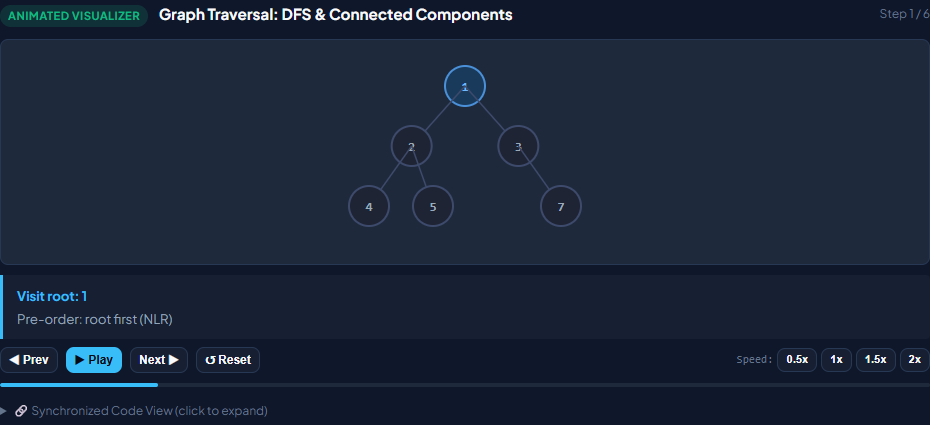
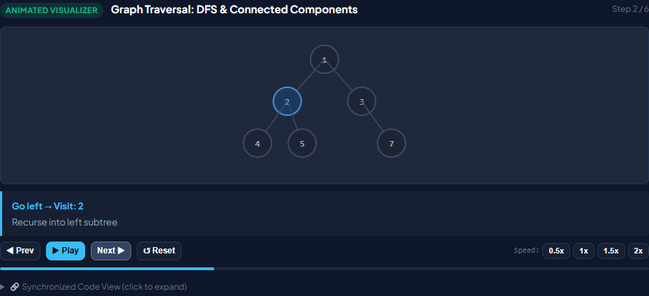
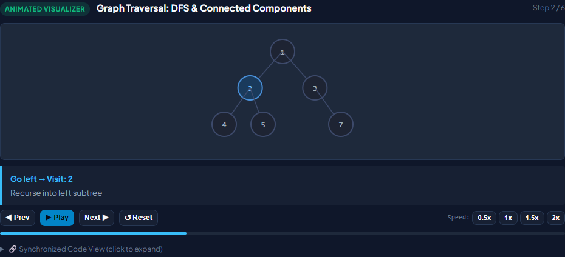

## Day 25 Visualizer
- **Status**: PASS
- **Play/Pause**: True/True
- **Next/Prev**: True/True
- **Reset**: True
- **Java Sync**: False
- **Mobile**: True

### States
1. **Initial**: Init dp[0][*]=0, dp[*][0]=0
2. **Middle**: Item 1 (w=1,v=1): dp[1][1]=max(dp[0][1], dp[0][0]+1)=1
3. **Final**: Item 1 (w=1,v=1): dp[1][1]=max(dp[0][1], dp[0][0]+1)=1

### Screenshots
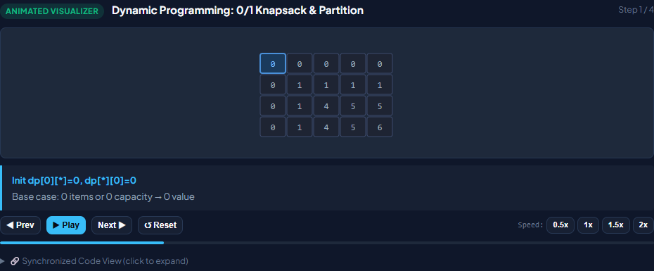
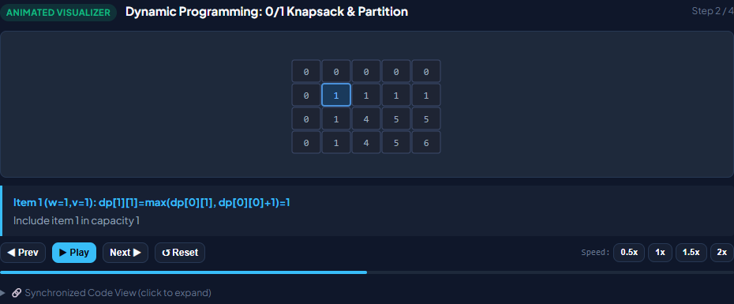

## Day 30 Visualizer
- **Status**: PASS
- **Play/Pause**: True/True
- **Next/Prev**: True/True
- **Reset**: True
- **Java Sync**: False
- **Mobile**: True

### States
1. **Initial**: Initial array state
2. **Middle**: Examining first two elements
3. **Final**: Examining first two elements

### Screenshots
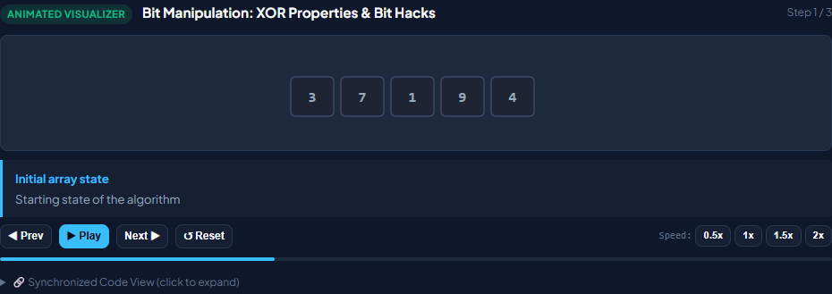
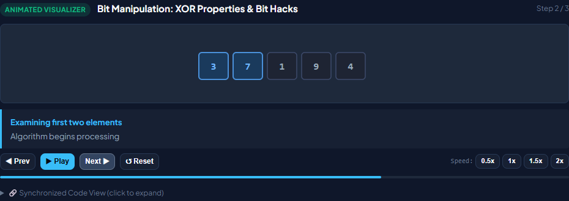
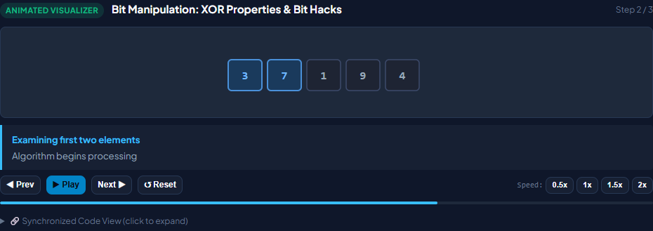

